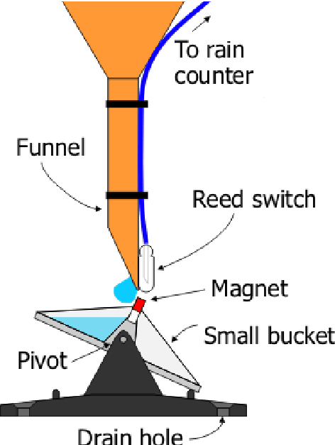

# Tipping Bucket Rain Gauge

For this project we are building a tipping bucket rain gauge similar to this one:

[Tipping Bucket Rain Gauge](https://www.youtube.com/watch?v=qzKWzTe7CEg)

I've used a 3D printer to print al the parts of the device. I've used a reed switch and a magnet to detect when the bucket swings.

The idea of the device is to have the next capabilities:

- [x] Work as a digital rain gauge (using the tipping bucket system).
- [ ] Measure temperature.
- [ ] Measure wind speed.
- [ ] Provide the coordinates where the device was installed using a GPS module.

Currently, the device counts the number of bucket swings and estimates the amount of millimeters of rainfall. The information is saved with the date (and the time resolution could be easily increased if we want to count the amount of millimeters of rainfall in an hour, minutes or seconds).

For the next modules, I'll be improving the device to be able to automatically calculate the Soil Evapotranspiration, using the temperature, wind speed and the information of the amount of millimeters of rainfall.

What peripherals are we using in our system?
- Reed Switch and Magnet for the tipping bucket system.
- LM35 temperature sensor.
- UART.

### Diagram
This diagram helps to understand how the typping bucket rain gauge works.



## Capabilities
- Register rainfall with the tipping bucket system, saving the registers by date.
- Save the last 100 of registers.

## Next steps
- Configure the GPS module.
- Configure the LM35 module.

## Configuration
In order to configure the date and time in the system in an easy way, the `date_and_time_config.py` script automatically gets the date and time, and configure the device using `UART`.

```bash
python date_and_time_config.py
```